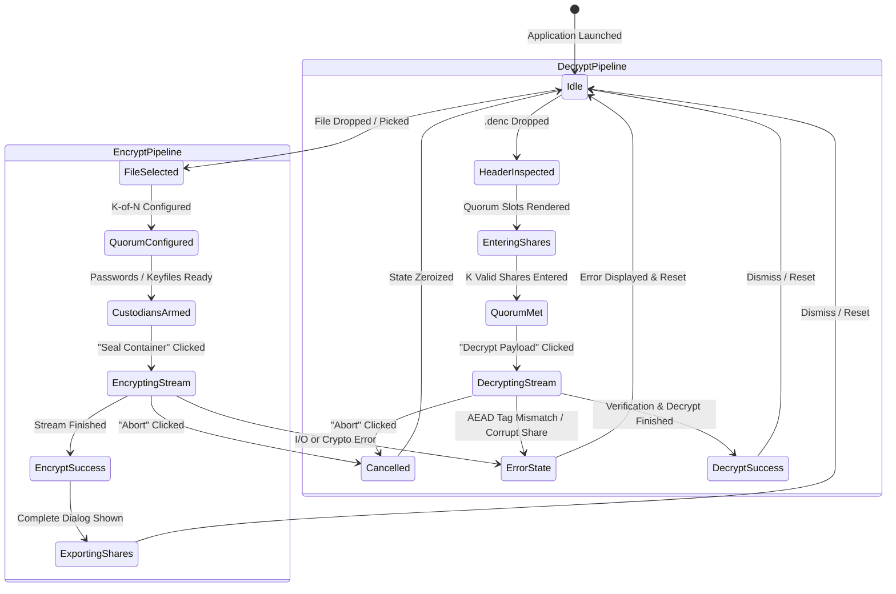

# 📐 Technical Design Document: DualCrypt Enterprise UI/UX & System Architecture

**Document Standard:** Google Engineering Design Doc Standard (v2025/2026)  
**Project:** DualCrypt Enterprise (Dual-Control & Threshold Encryption Platform)  
**Status:** Approved & Active Implementation  
**Target Environments:** Desktop (Tauri v2 / Native OS) & Web (Client-Side WebAssembly)  
**Primary Stack:** Rust (`denc-core`), Tauri v2, React 19, TypeScript, Tailwind CSS, Bun  

---

## 1. Context, Objectives & Scope

### 1.1 Problem Statement
In enterprise environments, encrypting mission-critical data with a single password creates an intolerable security vulnerability:
1. **Single Point of Compromise:** If one person's key or credential is leaked or stolen, the entire dataset is breached.
2. **Single Point of Failure (Extortion/Loss):** If a single key holder becomes unavailable or malicious, data is permanently lost.
3. **Lack of Dual Custody:** Regulatory mandates (e.g., NIST SP 800-57, PCI-DSS Dual Control, Common Criteria) require that two or more authorized individuals must concurrently authorize decryption ("Two-Man Rule").

Existing commercial Key Management Systems (KMS) or Hardware Security Modules (HSMs) are proprietary, heavy, and server-bound. DualCrypt provides a zero-trust, open, memory-safe desktop and web application that executes $(k, n)$ threshold secret sharing directly on client endpoints.

### 1.2 Core Design Tenets
* **Zero Trust & Zero Knowledge:** No plaintext keys, shares, or data ever leave the local client or touch a remote server.
* **Cyber-Minimalism:** High-contrast, dark-mode, distraction-free interface engineered for cryptographic operations.
* **Instant Visual Cryptography:** Clear visual feedback for mathematical quorums, progress gauges, and real-time streaming integrity.
* **Memory Safety & Zeroization:** Ephemeral state and key material are purged from memory immediately upon operation completion or cancellation.

### 1.3 Non-Goals
* **Central Cloud Key Storage:** DualCrypt will not maintain a centralized cloud repository of user passwords or plaintexts.
* **Unauthenticated Legacy Ciphers:** DualCrypt will not support unauthenticated modes (e.g., AES-CBC, AES-ECB) or weak hashing (e.g., MD5, SHA1).

---

## 2. User Personas & Operational Journeys

```
+-----------------------------------------------------------------------------------+
|                                 USER PERSONAS                                     |
+--------------------------+------------------------------+-------------------------+
| Persona A: Data Producer | Persona B: Dual Custodians   | Persona C: Escrow Admin |
| (Originator / P3)        | (P1 Client + P3 Co-Signer)   | (Disaster Recovery)     |
| Encrypts file, defines   | Physically present at device | Holds emergency 3rd     |
| (2-of-2) quorum, exports | to co-authorize decryption   | share for organizational|
| custodian share tokens.  | via passphrases / .dkeys.    | recovery.               |
+--------------------------+------------------------------+-------------------------+
```

### 2.1 Journey 1: Encryption & Threshold Distribution
1. User drops source file into the dropzone (instant size & path resolution).
2. User selects Quorum Profile:
   * **Strict Dual-Custody (2-of-2)**: Default enterprise two-man rule.
   * **Disaster Escrow (2-of-3)**: Two primary custodians + one disaster recovery share.
   * **Custom ($k$-of-$n$)**: Configurable threshold ($2 \le k \le n \le 16$).
3. User assigns authentication methods for each custodian:
   * **Passphrase**: Encrypted into `.denc` container header with Argon2id ($m=64\text{ MB}, t=3, p=4$).
   * **Keyfile (`.dkey`)**: Exported as standalone binary slice for offline/USB distribution.
4. User clicks **"Encrypt & Seal Container"**; the streaming engine writes `.denc` with chunked AEAD authentication.
5. Completion dialog provides export options: direct `.dkey` download, ZIP bundle with instructions, and container summary.

### 2.2 Journey 2: Dual-Custody Co-Presence Decryption
1. User drops `.denc` file into the dropzone.
2. System immediately parses the binary header and displays:
   * Required Threshold ($k$ of $n$).
   * Cipher ID (AES-256-GCM / XChaCha20-Poly1305).
   * Interactive Custodian Slots matching container metadata.
3. Custodians provide credentials:
   * Custodian 1 inputs their Argon2id passphrase.
   * Custodian 2 inputs their passphrase or attaches their `.dkey` keyfile.
4. The **Threshold Meter** updates dynamically ($0/2 \rightarrow 1/2 \rightarrow 2/2\text{ Quorum Achieved}$).
5. When quorum is reached, the **"Reconstruct & Decrypt"** action activates.
6. The streaming engine reconstructs the Master DEK in RAM, authenticates chunks in real-time, and writes the verified plaintext.

---

## 3. Design System & Visual Architecture

### 3.1 Design Philosophy: "Cyber-Minimalism"
The interface evokes high-assurance enterprise security using deep slate canvases, crisp border contrasts, glowing cryptographic status indicators, and monospace data representation for cryptographic primitives.

### 3.2 Color Tokens & Semantic Palette

```
+-------------------------------------------------------------------------------+
| SEMANTIC PALETTE                                                              |
+---------------------+-------------------+-------------------------------------+
| Role                | Hex / Tailwind    | Application                         |
+---------------------+-------------------+-------------------------------------+
| Background Canvas   | #080B13           | Main app background                 |
| Surface Card (Base) | #0F172A (slate-900) Card containers & panels            |
| Border Accent       | #1E293B (slate-800) Subtle structural borders             |
| Primary Brand/Cyan  | #06B6D4 (cyan-500)| Focus rings, active states, accents |
| Emerald (Success)   | #10B981 (emerald) | Quorum reached, verified shares     |
| Amber (Warning)     | #F59E0B (amber)   | Missing shares, intermediate state  |
| Rose (Danger/Error) | #EF4444 (rose-500)| Cryptographic mismatch, auth fail   |
| Monospace Accent    | #94A3B8 (slate-400) Hashes, paths, key IDs, chunk stats |
+---------------------+-------------------+-------------------------------------+
```

### 3.3 Typography Hierarchy
* **Primary Sans:** Inter / System Sans (`-apple-system, BlinkMacSystemFont, "Segoe UI", Roboto`) for UI text, labels, and descriptions.
* **Monospace:** JetBrains Mono / SF Mono / `Fira Code` for cryptographic identifiers, key hashes, byte counters, and file paths.

```
H1 / Header Title: 20px (font-semibold, tracking-tight, slate-100)
Section Header:    14px (font-medium, uppercase, tracking-wider, slate-400)
Body Text:         14px (font-normal, slate-300)
Subtext / Meta:    12px (font-normal, slate-400 / slate-500)
Code / Crypto ID:  13px (font-mono, font-medium, cyan-400 / emerald-400)
```

### 3.4 Ambient Styling & Elevation
* **Cyber Ambient Grid:** 32px subtle SVG dot/line background grid with radial cyan flare at top center.
* **Glassmorphism Elevation:**
  * `backdrop-blur-md` on modals and sticky navigation.
  * Border highlight: `border border-slate-800 hover:border-slate-700 transition-colors`.

---

## 4. Component Hierarchy & Layout Specifications

```
+-------------------------------------------------------------------------------+
| App Shell (Container max-w-6xl mx-auto px-4 py-8)                             |
+-------------------------------------------------------------------------------+
| [Header] Logo, Title, Active Cipher Badge, Zero-Trust Status Indicator        |
+-------------------------------------------------------------------------------+
| [TabNav] Encrypt Mode (Lock) | Decrypt Mode (Unlock)                          |
+-------------------------------------------------------------------------------+
| [Main Grid: 12-Column Responsive Layout]                                      |
|                                                                               |
|  LEFT COLUMN (5 Cols): Source Payload & Config                                |
|  +-------------------------------------------------------------------------+  |
|  | [FileDropzone] Drag-and-drop file target / OS file picker trigger       |  |
|  | [FileMetadataCard] Filename, size, extension, SHA-256 preview badge     |  |
|  | [QuorumConfigurator] (Encrypt Mode) Preset buttons & (k, n) steppers    |  |
|  | [CipherSelector] AES-256-GCM vs XChaCha20-Poly1305 selector             |  |
|  +-------------------------------------------------------------------------+  |
|                                                                               |
|  RIGHT COLUMN (7 Cols): Threshold & Custodian Matrix                          |
|  +-------------------------------------------------------------------------+  |
|  | [ThresholdMeter] Quorum progress bar (e.g., 2/2) with glowing node dots|  |
|  | [CustodianGrid] Dynamic responsive grid of CustodianCards               |  |
|  |   - Card 1: Custodian Label, Auth Type Toggle (Passphrase / Keyfile)    |  |
|  |   - Card 2: Password input with visibility toggle / Keyfile drag-target |  |
|  |   - Card 3: Status Badge (Pending / Key Loaded / Passphrase Entered)    |  |
|  +-------------------------------------------------------------------------+  |
+-------------------------------------------------------------------------------+
| [Execution Panel] Action Button ("Seal Container" / "Decrypt Payload")        |
| [LiveCryptoProgress] Streaming progress bar, throughput (MB/s), Cancel button  |
+-------------------------------------------------------------------------------+
| [CompleteDialog] Modal overlay upon completion with share export options      |
+-------------------------------------------------------------------------------+
```

---

## 5. Detailed Component Specifications

### 5.1 `ThresholdMeter`
* **Purpose:** Provides immediate, high-contrast visual confirmation of whether the cryptographic threshold is satisfied.
* **Visual States:**
  * **Insufficient ($< k$ shares):** Amber warning theme, pulsing border, status badge: `Awaiting Custodians (1/2)`.
  * **Quorum Satisfied ($\ge k$ shares):** Emerald victory glow, active checkmark, status badge: `Quorum Satisfied (2/2) — Ready to Decrypt`.
  * **Over-Quorum ($> k$ shares):** Blue surplus indicator: `Quorum Exceeded (3/2) — Redundant Shares Available`.

### 5.2 `CustodianCard`
* **Features:**
  * **Label Customization:** Editable name (e.g., "Custodian 1: Alice (CFO)", "Custodian 2: Bob (Legal)").
  * **Auth Switcher:** Clean pill toggle between **Passphrase** (Argon2id) and **Keyfile** (`.dkey`).
  * **Passphrase Input:** Masked input with instant length validation and eye reveal toggle.
  * **Keyfile Drop Target:** Miniature dropzone inside the card to drop specific `.dkey` files with auto-detection of Custodian ID.

### 5.3 `LiveCryptoProgress`
* **Features:**
  * **Real-Time Stream Metrics:** Displays total bytes processed, percentage, and instantaneous I/O throughput (e.g., `482.4 MB/s`).
  * **Atomic Cancellation:** Red "Abort Operation" button sending a thread-safe atomic cancellation signal to Rust, stopping file I/O immediately and zeroizing RAM.

### 5.4 `CompleteDialog`
* **Features:**
  * Displays output file path, byte size, and execution duration.
  * **Export Suite (Encrypt Mode):**
    * Download all `.dkey` keyfiles individually.
    * Download consolidated ZIP archive containing all keys and a markdown recovery guide (`RECOVERY_INSTRUCTIONS.txt`).
    * Clear/Dismiss button that resets state and zeroizes transient memory.

---

## 6. Interaction State Machine (FSM)



---

## 7. Accessibility (A11y) & Usability

* **WCAG 2.1 Level AA Compliance:**
  * Contrast ratio $\ge 4.5:1$ on all interactive text elements against slate backgrounds.
  * Focus indicators: `focus-visible:ring-2 focus-visible:ring-cyan-500 focus-visible:outline-none`.
* **Keyboard Navigation:**
  * Full tab indexing across Dropzones, Quorum Steppers, Auth Toggles, and Inputs.
  * `Escape` key immediately closes completion dialogs or aborts confirmation prompts.
* **Screen Reader Support:**
  * Progress updates utilize `aria-live="polite"` to announce milestone percentages (25%, 50%, 75%, 100%).
  * Cryptographic alerts utilize `role="alert"` for instant error notification.

---

## 8. Security & Memory Hygiene UX Guardrails

1. **Zero Browser Autofill:** Password inputs explicitly set `autoComplete="new-password"` and `data-lpignore="true"` to prevent password managers from cross-contaminating custodian fields.
2. **Ephemeral React State:** Password states and share buffers are scrubbed from React state upon modal dismissal or tab switching.
3. **Rust Memory Isolation:** Decryption keys and Shamir polynomial coefficients are managed inside `Zeroizing<Vec<u8>>` containers, wiped on drop.
4. **Accidental Exit Prevention:** While a stream is running, browser/window close events trigger an OS warning prompt to prevent corrupt output files.

---

## 9. Future Evolution & Roadmap UI Additions

| Feature | Target Phase | UI Impact |
| :--- | :--- | :--- |
| **PIN-Protected `.dkey` Keyfiles** | Phase 1.1 | Password input modal when selecting/exporting `.dkey` files. |
| **Settings & SMTP Email Dispatch** | Phase 1.2 | Settings drawer to configure SMTP credentials and one-click email dispatch of `.dkey` tokens to custodians. |
| **YubiKey / FIDO2 Authentication** | Phase 1.3 | "Hardware Key" tab in `CustodianCard` with animated USB tap prompt. |
| **Air-Gapped QR Handshake** | Phase 2.1 | Animated QR generator & camera scanner modal for mobile approvals. |
| **NIST PQC (ML-KEM-768) Badges** | Phase 2.2 | Quantum-safe badge in header and public key assignment per custodian. |
