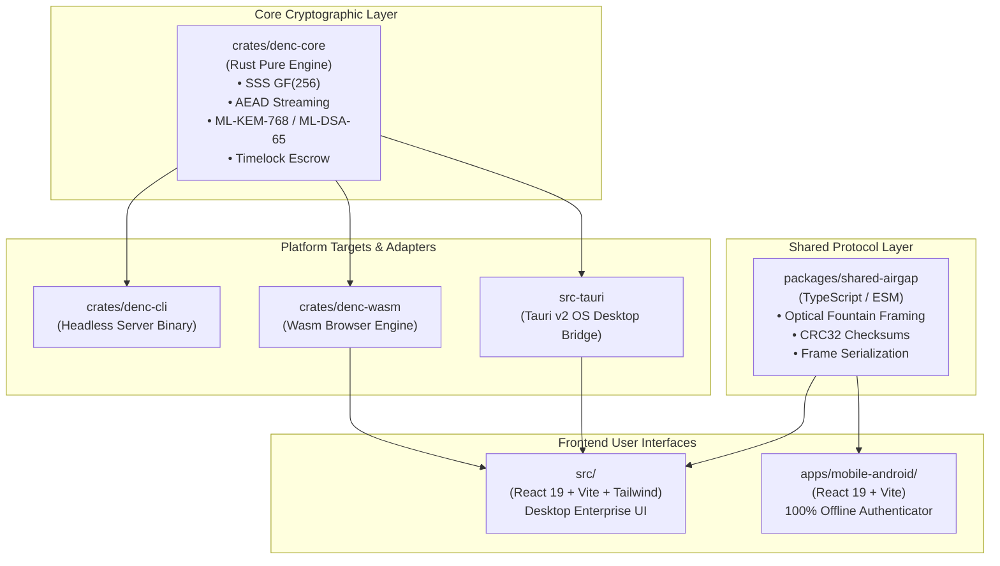

# 🏛️ DualCrypt Enterprise Architecture

DualCrypt Enterprise is architected as a modular, multi-target, zero-trust cryptographic platform. The system enforces strict separation of concerns across cryptographic primitives, platform runtimes, and user interfaces.

---

## 📂 Repository Topology

| Path | Language / Runtime | Purpose |
| :--- | :--- | :--- |
| [`crates/denc-core`](file:///i:/01-Master_Code/Apps/Dual_Encryption/crates/denc-core) | Rust (`cargo`) | Shared cryptographic engine containing Shamir's Secret Sharing ($GF(256)$), streaming AEAD (AES-256-GCM / XChaCha20-Poly1305), NIST FIPS 203 ML-KEM-768, NIST FIPS 204 ML-DSA-65, Argon2id KDF, and `.denc` container serialization. |
| [`crates/denc-cli`](file:///i:/01-Master_Code/Apps/Dual_Encryption/crates/denc-cli) | Rust (`cargo`) | Standalone command-line binary (`denc`) with subcommands `encrypt`, `decrypt`, `inspect`, and `serve`. |
| [`crates/denc-wasm`](file:///i:/01-Master_Code/Apps/Dual_Encryption/crates/denc-wasm) | Rust $\rightarrow$ WebAssembly (`wasm-bindgen`) | Zero-Knowledge browser decryptor and container inspector compiled directly to WebAssembly. |
| [`src-tauri`](file:///i:/01-Master_Code/Apps/Dual_Encryption/src-tauri) | Rust (`Tauri v2`) | Native OS desktop runtime handling file system streaming, Windows Explorer launch arguments, file associations (`.denc`, `.dkey`, `.pqc`), and YubiKey USB detection. |
| [`packages/shared-airgap`](file:///i:/01-Master_Code/Apps/Dual_Encryption/packages/shared-airgap) | TypeScript / ESM (`bun`) | Common library defining animated QR fountain frame protocols, challenge-response state machines, and payload validators with zero code duplication. |
| [`src`](file:///i:/01-Master_Code/Apps/Dual_Encryption/src) | React 19 + Vite + Tailwind | Main enterprise desktop frontend with dark cyber UI, split-screen live progress meters, provenance passports, and Key Escrow Vault. |
| [`apps/mobile-android`](file:///i:/01-Master_Code/Apps/Dual_Encryption/apps/mobile-android) | React 19 + Vite + Android | Dedicated 100% offline mobile authenticator app with biometric/PIN hardware gate and animated QR camera scanner. |

---

## 🔒 Security Invariants & Zero-Trust Design

1. **Zero Server Trust**: In both desktop and web client deployments, cryptographic keys are never sent across a network. Encryption, key splitting, and reconstruction occur exclusively in local memory.
2. **Ephemeral Memory Hygiene**: All reconstructed Master Data Encryption Keys (DEKs), intermediate polynomials, and private keys implement `zeroize::ZeroizeOnDrop` or explicit zeroization to prevent memory forensic extraction.
3. **Chunked Streaming & Constant Memory**: Files of any size (up to multi-terabyte datasets) are processed in 64 KiB chunks with $O(1)$ memory consumption ($<20\text{ MB}$ RAM).
4. **Information-Theoretically Secure Quorum**: Possessing $< k$ shares reveals mathematically $0$ bits of entropy regarding the master decryption key.
