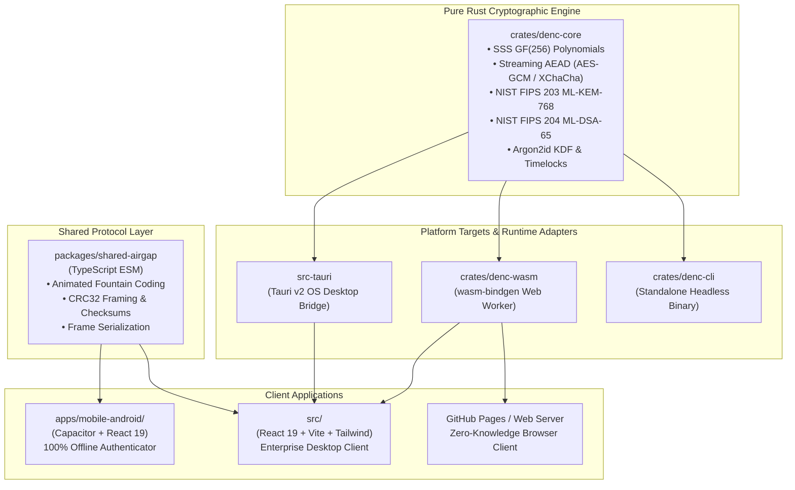
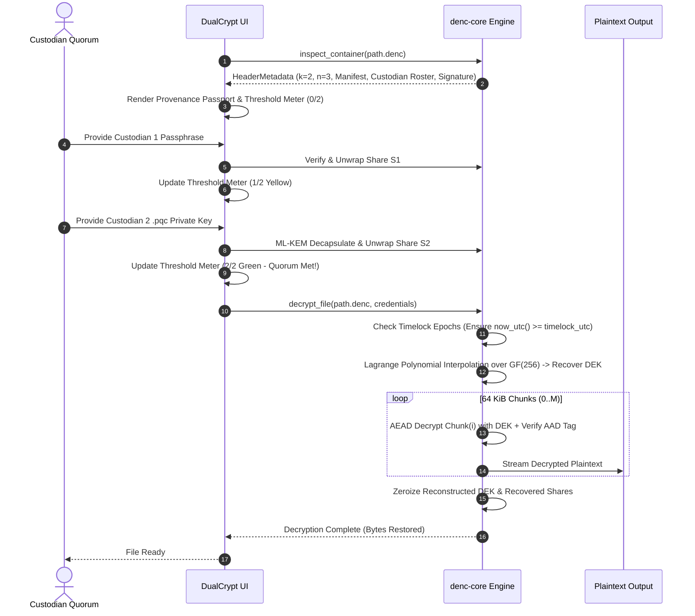
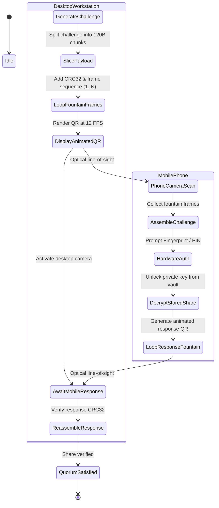

# 🏛️ DualCrypt System Architecture & Technical Diagrams

DualCrypt Enterprise is designed as a modular, multi-target cryptographic ecosystem. The system enforces strict separation of concerns across cryptographic primitives, platform runtimes, and user interfaces.

---

## 📑 Contents
1. [High-Level System Topology](#1-high-level-system-topology)
2. [Dual-Custody Encryption Pipeline Diagram](#2-dual-custody-encryption-pipeline-diagram)
3. [Dual-Custody Decryption & Quorum Reconstruction](#3-dual-custody-decryption--quorum-reconstruction)
4. [Air-Gapped Optical Fountain State Machine](#4-air-gapped-optical-fountain-state-machine)
5. [Tauri v2 OS Desktop Bridge & IPC Protocol](#5-tauri-v2-os-desktop-bridge--ipc-protocol)
6. [WebAssembly In-Browser Worker Model](#6-webassembly-in-browser-worker-model)

---

## 1. High-Level System Topology



---

## 2. Dual-Custody Encryption Pipeline Diagram

```mermaid
sequenceDiagram
    autonumber
    actor Creator as User / Pipeline
    participant App as DualCrypt Frontend
    participant Core as denc-core Engine
    participant CSPRNG as OS CSPRNG (getrandom)
    participant Disk as Output File (.denc)

    Creator->>App: Drops File & Configures Quorum (k=2, n=3)
    App->>Core: encrypt_file(path, params)
    Core->>CSPRNG: Generate 32-byte DEK (Data Encryption Key)
    Core->>Core: Split DEK via Shamir GF(256) -> Shares [S1, S2, S3]
    
    rect rgb(20, 30, 45)
        note right of Core: Custodian Share Wrapping
        Core->>Core: S1 -> Encrypt with Custodian 1 Passphrase (Argon2id + AES-GCM)
        Core->>Core: S2 -> Encapsulate with Custodian 2 ML-KEM-768 Public Key
        Core->>Core: S3 -> Export as .dkey File / Escrow Timelock
    end

    opt Optional Digital Signature
        Core->>Core: Compute Header Digest SHA-256
        Core->>Core: Sign Header with Author ML-DSA-65 Private Key
    end

    Core->>Disk: Write Authenticated DencHeader (Bytes 0..N)
    
    loop 64 KiB Chunks (0..M)
        Core->>Core: AEAD Encrypt Chunk(i) with DEK + AAD(HeaderDigest || i || is_final)
        Core->>Disk: Stream Chunk Ciphertext + 16B Poly1305/GCM Tag
    end

    Core->>Core: Zeroize DEK, S1, S2, S3, and Intermediate Key Buffers
    Core-->>App: Return Success + Exported Key Files
    App-->>Creator: Displays Provenance Confirmation
```



---

## 3. Dual-Custody Decryption & Quorum Reconstruction



---

## 4. Air-Gapped Optical Fountain State Machine



---

## 5. Tauri v2 OS Desktop Bridge & IPC Protocol

The desktop runtime connects the React 19 frontend to the Rust OS bridge via Tauri v2 strongly-typed IPC commands:

```
[ React 19 / TypeScript Frontend ]
                |
    invoke("plugin:tauri|command", payload)
                v
+-------------------------------------------------------------+
|                     Tauri v2 IPC Router                     |
|                                                             |
|  * commands::encrypt::encrypt_file_command                  |
|  * commands::decrypt::decrypt_file_command                  |
|  * commands::inspect::inspect_container_command             |
|  * commands::yubikey::poll_yubikey_devices                  |
|  * commands::shares::generate_pqc_keypair_command           |
|  * commands::app::get_app_version                           |
+-------------------------------------------------------------+
                |
                v
[ crates/denc-core (Pure Rust Engine) ]
```

---

## 6. WebAssembly In-Browser Worker Model

In the browser client, all intensive cryptographic computations and streaming operations are offloaded to dedicated Web Workers to ensure a responsive 60 FPS UI:

```
+-------------------------------------------------------------+
|                    Browser Main Thread                      |
|           (React 19 / Tailwind / Drag-and-Drop)             |
+-------------------------------------------------------------+
             |                                  ^
     postMessage(FilePayload)          postMessage(Progress, Data)
             v                                  |
+-------------------------------------------------------------+
|                     Web Worker Thread                       |
|                                                             |
|   [ denc-wasm (Rust compiled with wasm-bindgen) ]           |
|     * Argon2id KDF Memory Expansion (64 MB)                 |
|     * GF(256) Lagrange Polynomial Reconstruction            |
|     * Chunked AES-256-GCM Decryption                        |
+-------------------------------------------------------------+
```
